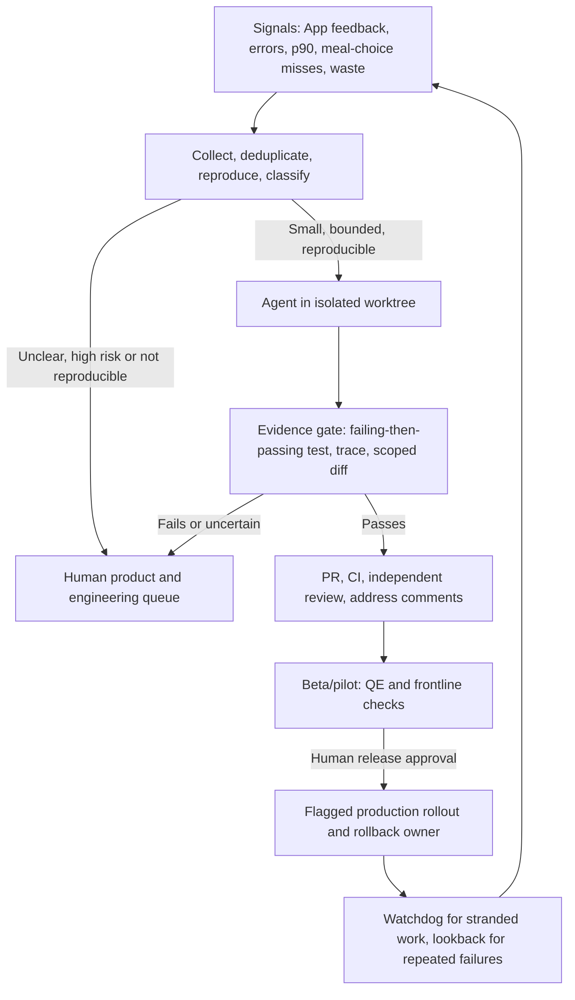
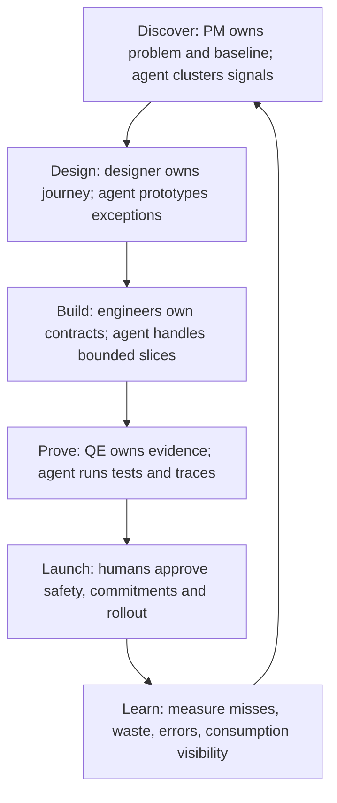
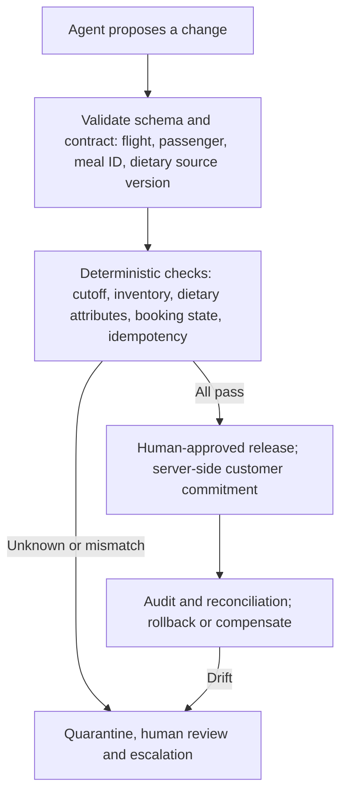
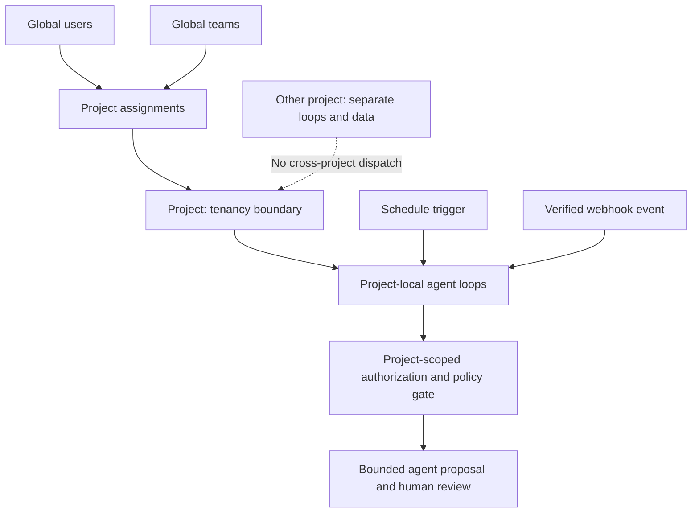

# Editable workflow diagrams

These editable diagrams show a proposed meal-preorder delivery workflow, not a customer-facing agent or a live system architecture. They use synthetic examples and keep customer commitments and releases under human control.

## 1. Product signal to verified release

## 2. Inception to production, with human ownership

## 3. Fail-closed meal-preorder commitment

**Boundary:** an engineering agent may propose and test code, but it cannot infer allergen safety or commit a customer's meal. The live service and approved humans own authoritative data and irreversible changes.

## 4. Project tenancy and loops (proposed control plane)

**Demo limit:** `fixtures/workspace.json` and `packages/contracts/src.js` model this boundary and match synthetic schedule/webhook descriptors. No real scheduler, webhook receiver, signature check, persisted tenant isolation or agent model runs in this package.
